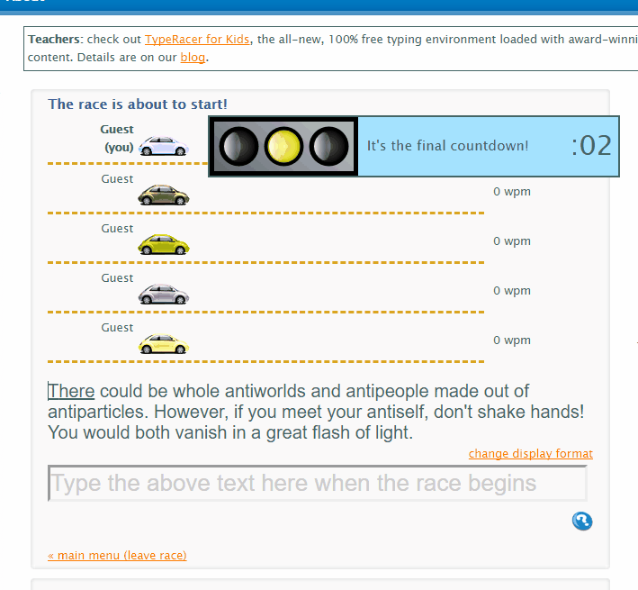

# TypeRacer

Script that goes to https://play.typeracer.com and types in the paragraph using web driver automation via Selenium.

Types each letter using random time intervals. Time intervals can be played with to achieve higher or lower WPM using the `start_typing` method.

Note: As a way of bot detection, the website auto-kicks if the WPM exceeds 400WPM.

